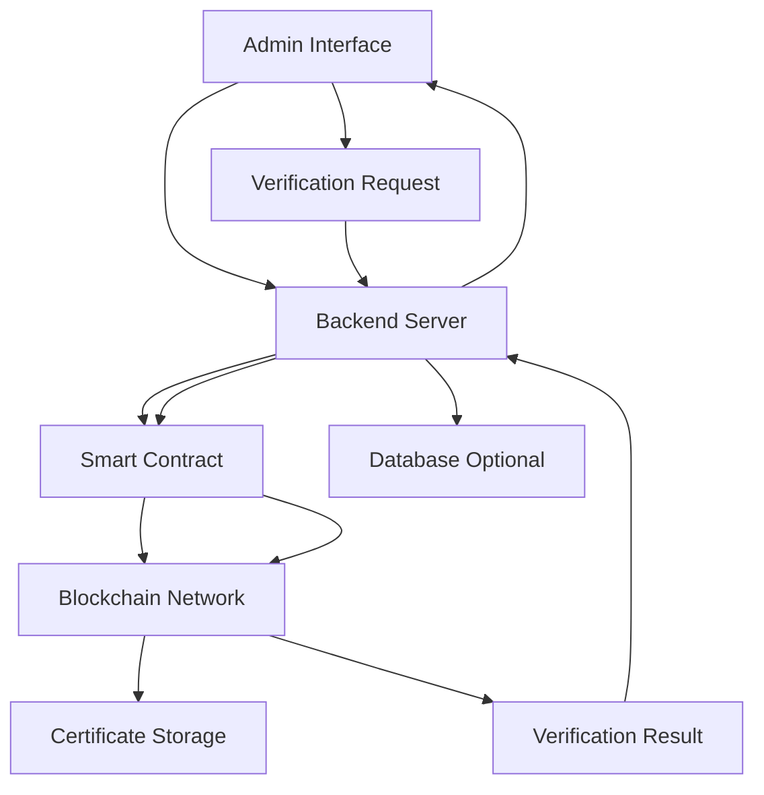

# 🎓 Blockchain-Based Certification Verification System

## 📌 Overview

The Blockchain-Based Certification Verification System is a secure and tamper-proof platform designed to issue, store, and verify academic or professional certificates using blockchain technology.

This system eliminates fake certificates by ensuring that every certificate is stored as a unique, immutable record on the blockchain, enabling instant and trustworthy verification.

---

## 🎯 Objectives

* Prevent certificate forgery and duplication
* Ensure secure and decentralized certificate storage
* Provide instant and reliable verification
* Reduce manual verification effort
* Improve transparency and trust

---

## 🛠️ Technologies Used

* Frontend: HTML, CSS, JavaScript
* Backend: Python (Flask)
* Blockchain: Ethereum (Smart Contracts - Solidity)
* Database: MongoDB / MySQL (Optional)
* Tools: VS Code, Git, GitHub

---

## ⚙️ Features

* Secure certificate issuance
* Blockchain-based certificate storage
* Instant certificate verification
* Unique certificate hash/ID generation
* Admin control panel
* Prevention of duplicate or fake certificates

---

## 🏗️ Architecture Diagram



---

## 🔍 Architecture Explanation

* The Admin Interface allows users to upload and verify certificates.
* The Backend Server processes requests and communicates with the blockchain.
* The Smart Contract stores certificate data securely.
* The Blockchain Network ensures immutability and security.
* Each certificate has a unique hash or ID.
* The system verifies certificates by comparing the hash with blockchain data.
* The result is returned as valid or invalid.

---

## 🔄 Working Process

### 📥 Certificate Issuance

1. Admin uploads certificate details
2. Data is sent to backend
3. Backend interacts with smart contract
4. Certificate is stored on blockchain
5. Unique hash/ID is generated

### 🔎 Certificate Verification

1. User enters certificate ID or hash
2. Request is sent to backend
3. Backend queries blockchain
4. Smart contract validates data
5. Result is displayed (Valid / Invalid)

---

## 🏗️ Project Structure

```
cursorproject/
├── backend/
│   ├── app.py
│   └── requirements.txt
├── frontend/
│   ├── index.html
│   └── styles.css
├── smart_contract/
│   └── contract.sol
└── README.md
```

## 🚀 How to Run the Project

### 1️⃣ Clone Repository

git clone [https://github.com/Paskalgarryvinu/Blockchain-Based-Certification-Verification-System.git](https://github.com/Paskalgarryvinu/Blockchain-Based-Certification-Verification-System.git)

### 2️⃣ Go to Project Folder

cd Blockchain-Based-Certification-Verification-System

### 3️⃣ Setup Backend

cd backend
pip install -r requirements.txt

### 4️⃣ Run Application

python app.py

### 5️⃣ Open in Browser

[http://localhost:5000](http://localhost:5000)

---

## 🔮 Future Enhancements

* Mobile application support
* Multi-university integration
* QR code-based verification
* AI-based fraud detection
* Cloud deployment

---

## 📄 License

This project is for educational purposes.

---

## 👨‍💻 Author

Garry (Vinu)
Final Year Project

---

# 🎯 FINAL NOTE

👉 This version is **fully fixed**
✔ Diagram will render
✔ Explanation will NOT merge
✔ No syntax errors

---
